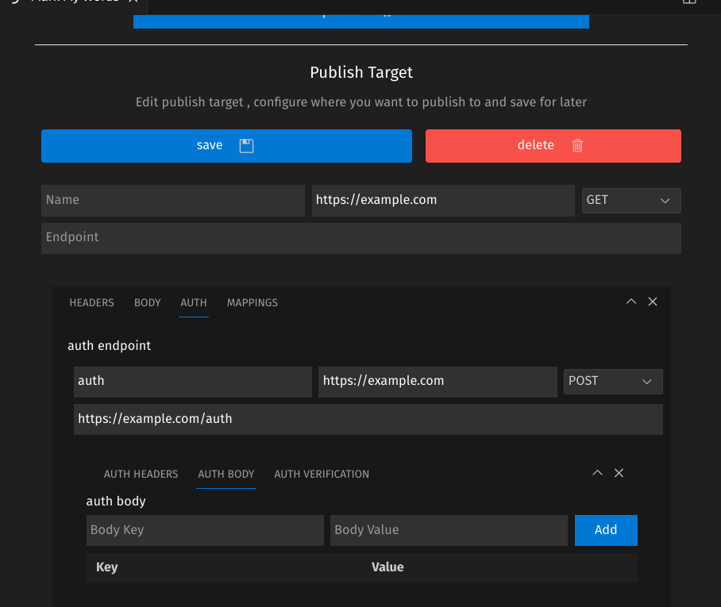

# Mark My Words

A vscode extension tio publish selected snippet of text to an endpoint

usage

- select a block of text or markdown and trigger th extension using `ctrl/cmd + shift + p` then type `Publish selected`

configure the endpoint in the extension settings


- the fisrt level requires
- the name you wan to give this
- the base url
- the method
- the endpoint (will be joied with the base url)
- the headers
- the body (key , value)

  > [!NOTE]
  > title,description and content will be the default locatiosn but you can configure paggings to pint to other fileds in you body request

```json
{
  "formData.title": "body.title",
  "formData.description": "body.description",
  "formData.content": "body.markdown", // my backend expects a field named markdown insted of content
  "request.token": "headers.Authorization" // when you add an auth method it will add the returned token to this header
}
```
adding these hints will auto extract the title and description for you
```md
// ---Title:This title will be extracted
// ---Description:This description will be extracted
```

> [!NOTE]   
> It looks ugly and clutterd but it works. so if you have ideas how to make it look better please let me know

### Tech stack

vite + preact + typescript + tailwindcss + zustand

helpful references:

- [vite plugin vscode](https://github.com/tomjs/vite-plugin-vscode) : use any vite framework to write your webviews
- [vscode-tailwind](https://github.com/githubocto/tailwind-vscode): a tailwind plugin with all the vscode color variables and utilities
- [vscode-elements](https://vscode-elements.github.io/getting-started/) : a set of web components that align with vscode style
- [vscode elements react example](https://github.com/vscode-elements/react-example/tree/main)

- [Ben awad intor to vscode plugins](https://youtu.be/a5DX5pQ9p5M?si=AZWMJRoGVLPdtTi7) : old video on how to use vscode plugins , probably use the stater code fro the vite vscode repo but the commands and techniques are almost the same
  > [!NOTE]
  > if you pick react remember to disbable strict mode
